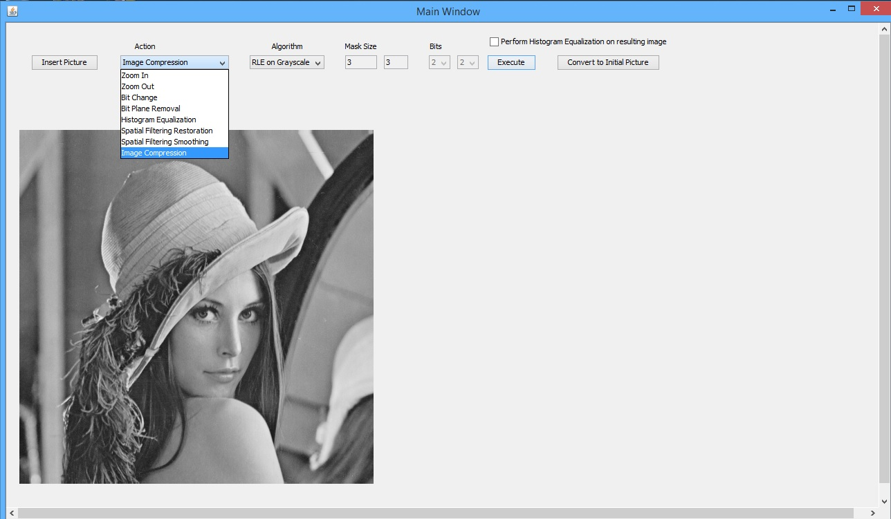
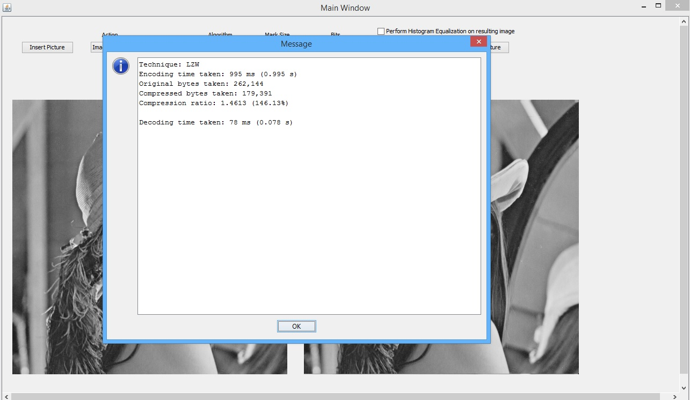

# Image Processing


Various techniques used for Image Processing. The techniques include:
* Zooming In - downsampling an image
* Zooming Out - upsampling an image. Algorithms implemented are:
  * Nearest Neighbor
  * Linear Interpolation in the x direction
  * Linear Interpolation in the y direction
  * Bilinear
* Bit Removal - Removing a bit plane by setting that bit plane to 0
* Histogram Equalization - Perform histogram equalization on an image. The implemented algorithms are:
  * Global Histogram Equalization
  * Local 3x3 Mask
  * Local 5x5 Mask
  * Local 7x7 Mask
  * Local 9x9 Mask
* Spatial Filtering Restoration - Remove noise from an image. The implemented algorithms are:
  * Arithmetic mean filter
  * Geometric mean filter
  * Harmonic mean filter
  * Contraharmonic mean filter
  * Max filter
  * Min filter
  * Midpoint filter
  * Alpha-trimmed mean filter
* Spatial Filtering Smoothing - Blur and sharpen an image. The implemented algorithms are:
  * Smoothing filter
  * Mean filter
  * Sharpening Laplacian filter
  * High-boost filter
* Image Compression - Various image compression/decompression techniques. The implemented algorithms are:
  * Run Length End (RLE) on grayscale values
  * RLE on Bit Planes
  * Huffman Encoding/Decoding
  * Lempel–Ziv–Welch (LZW) Encoding/Decoding



# How To Compile
Type the following into a terminal:
```
javac -d bin ./src/imgpro/*.java ./src/imgpro/bitchange/*.java ./src/imgpro/bitplane/*.java ./src/imgpro/histogram/*.java ./src/imgpro/imagecompression/*.java ./src/imgpro/restoration/*.java ./src/imgpro/spatialfiltering/*.java ./src/imgpro/zooms/*.java 
```

# How To Run
1. Change into the /bin/ directory
2. Type the following into a terminal:
```
java imgpro.MainWindow
```
